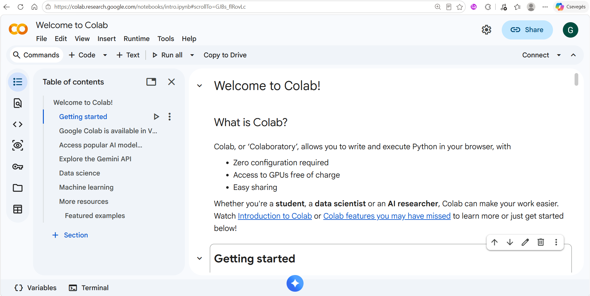

## Learning objectives

After completing this lesson, you should be able to:

- explain the basic steps involved in creating and running a computer program;
- distinguish between an editor, compiler, interpreter, linker, loader, and IDE;
- describe the main characteristics of the Python programming language;
- identify common application areas of Python;
- create and run a simple Python program in Google Colab;
- distinguish between syntax, runtime, and logic errors;
- use the `print()` function to display output;
- use the `sep` and `end` arguments of the `print()` function;
- use basic escape sequences in strings.

## Introduction to programming

A computer program is a sequence of instructions that tells a computer how to
perform a particular task.

Computers ultimately execute instructions represented in machine code.
Programming languages allow programmers to express algorithms and instructions
in a form that is easier for humans to write, read, and maintain.

Programming languages can be classified in several ways. One common distinction
is between **low-level** and **high-level** programming languages.

High-level programming languages provide abstractions that allow programmers to
focus more on solving the problem and less on the technical details of the
underlying hardware.

## The Python language

Python is a **general-purpose, high-level programming language**.

Some of its main characteristics are:

- easy to read and write;
- free and open source;
- supports multiple programming paradigms;
- strongly and dynamically typed;
- interpreted;
- has a large standard library;
- cross-platform.

::: {.callout-note}
## Python in this course

The primary goal of this course is **not simply to learn the Python language**.

Python is used as a tool for learning fundamental programming concepts,
problem-solving techniques, and algorithmic thinking.

When designing algorithms, we primarily use the three fundamental control structures:

- **sequence** – instructions are executed one after another,
- **selection** – different paths can be chosen depending on a condition,
- **iteration** – instructions can be repeated using loops.

The course focuses on solving problems using the core features of Python. 
External libraries such as **NumPy** and **pandas** are not used.

The only exception is Python's built-in **`random` module**, which will be used 
in some exercises when random values are required.

The concepts introduced in this course can also be applied when learning other
programming languages.
:::

## What is Python commonly used for?

Python is used in many areas of computing, including:

- data analysis and machine learning;
- web applications;
- task automation;
- software testing and prototyping;
- business applications;
- scientific computing;
- scripting and everyday programming tasks.

## A brief history of Python

Python was created by **Guido van Rossum** in the late 1980s.

Some important milestones are:

- **1994 – Python 1.0**
  - core data types and functions;
  - support for functional programming;

- **2000 – Python 2.0**
  - Unicode support;
  - list comprehensions;
  - garbage collection;

- **2008 – Python 3.0**
  - major redesign and simplification of the language;
  - removal of several duplicated or outdated language constructs;
  - not backward compatible with Python 2.

Python 3 is the current generation of the language and is used throughout this
course.

## Tools used to create and run programs

Writing source code is only one part of creating a program. Several tools may
be involved in transforming source code into a program that can be executed by
a computer.

### Editor

An **editor** is used to create and modify the source code of a program.

It allows the programmer to write, edit, and save the instructions that make up
the program.

### Compiler

A **compiler** translates source code into another representation, usually
machine code or object code, before the program is executed.

The translation is typically performed for a larger part of the program at
once.

### Interpreter

An **interpreter** executes a program with the help of another program rather
than producing a complete standalone machine-code program before execution.

Python uses an interpreter.

### Linker

A **linker** combines separately translated program modules and libraries into
the form required to create an executable program.

### Loader

A **loader** loads the executable program into memory so that the operating
system can start its execution.

## Integrated Development Environment

An **Integrated Development Environment (IDE)** combines several tools needed
for software development in one environment.

An IDE typically provides:

- a source code editor;
- tools for running programs;
- debugging tools;
- syntax highlighting;
- code completion;
- project and file management.

### Common Python IDEs

There are several popular IDEs available for Python programming:

- **Google Colab**
- **Jupyter Notebook**
- **Visual Studio Code**
- **PyCharm**
- **Spyder**
- **IDLE**

::: {.callout-tip}
## Our environment: Google Colab

In this course, we will primarily use **Google Colab**.

Google Colab is a good choice for beginners because it is:

- **browser-based** – it runs directly in a web browser;
- **easy to use** – students can start programming with minimal setup;
- **installation-free** – no local Python installation is required;
- **platform-independent** – it can be used on Windows, macOS, Linux, and
  other systems with a modern web browser;
- **cloud-based** – notebooks can be saved online and accessed from different
  computers;
- **easy to share** – notebooks can be shared similarly to other Google
  documents.
:::

Open Google Colab in your browser: [Google Colab](https://colab.research.google.com/)

**Important:** You need a Google Account to use Colab and save your notebooks. 

{#fig-colab-interface .screenshot fig-align="left" width="75%"}

## Getting started with Google Colab

Google Colab provides a browser-based notebook environment for writing and
executing Python programs.

A notebook consists of **cells**.

The two most important cell types are:

- **code cells** – contain executable Python code;
- **text cells** – contain explanations, headings, notes, and other formatted
  text.

### Creating a new notebook

To create and run your first notebook:

1. open Google Colab;
2. create a new notebook;
3. click inside a code cell;
4. enter Python code;
5. run the cell using the **Run** button or by pressing **Shift + Enter**.

## Your first Python program

Traditionally, the first program written when learning a programming language
displays the text `Hello World`.

```{python}
print("Hello World")
```

The statement calls the Python `print()` function.

The text between quotation marks is passed to the function and displayed as
output.

Both single and double quotation marks can be used:

```{python}
print("Hello World")
print('Hello World')
```

## Errors in programs

Making mistakes is a normal part of programming. Finding and correcting errors
is an important programming skill.

There are several common types of errors.

### Syntax errors

A **syntax error** occurs when the source code violates the grammatical rules of
the programming language.

For example:

```python
print("Hello World)
```

Python cannot execute this statement because the closing quotation mark is
missing.

A syntax error usually results in an error message.

### Runtime errors

A **runtime error** occurs while the program is being executed.

For example:

```python
print(5 / 0)
```

The syntax is valid, but division by zero cannot be performed.

Python reports an exception such as:

```text
ZeroDivisionError: division by zero
```

### Logic errors

A **logic error** occurs when the program can be executed but does not produce
the intended result.

For example:

```{python}
print("5" + "6")
```

The result is:

```text
56
```

rather than:

```text
11
```

Logic errors can be especially difficult to find because the program may run
without displaying an error message.

## Debugging

The process of identifying and correcting errors in a program is called
**debugging**.

When a program does not work as expected:

1. read the error message carefully;
2. identify the line where the problem occurred;
3. check the code for syntax errors;
4. check for typing mistakes;
5. check whether the algorithm itself is correct;
6. test smaller parts of the program separately;
7. use the documentation or development tools if necessary.

Learning to understand error messages is an essential programming skill.

## The `print()` function

The `print()` function is used to display one or more values.

### Printing a single value

```{python}
print("Hello")
```

### Printing multiple values

Several values can be passed to the `print()` function:

```{python}
print("Monday", "Tuesday", "Wednesday")
```

By default, Python separates the values with spaces.

Text, numbers, and expressions can also be combined:

```{python}
print("5 * 6 is", 5 * 6)
```

### Printing an empty line

Calling `print()` without an argument produces an empty line:

```{python}
print("First line")
print()
print("Third line")
```

## The `sep` argument

The optional `sep` argument specifies the separator placed between multiple
values.

By default, the separator is a single space.

```{python}
print("One", "Two", "Three")
```

A different separator can be specified:

```{python}
print("One", "Two", "Three", sep="-")
```

```{python}
print("One", "Two", "Three", sep="|")
```

An empty string can also be used:

```{python}
print("One", "Two", "Three", sep="")
```

## The `end` argument

By default, the `print()` function ends its output with a new line.

The optional `end` argument can change this behaviour.

```{python}
print("One", "Two", sep=" ", end=" ")
print("Three")
```

In this example, the second `print()` call continues on the same line.

## Escape sequences

An **escape sequence** represents a special character inside a string.

Some commonly used escape sequences are:

| Escape sequence | Meaning |
|---|---|
| `\n` | new line |
| `\t` | horizontal tab |
| `\r` | carriage return |

### New line

```{python}
print("Monday\nTuesday\nWednesday")
```

### Tab

```{python}
print("Name\tScore")
print("Anna\t85")
print("John\t92")
```

## Quotation marks inside strings

Sometimes quotation marks themselves need to appear in the output.

One possibility is to use different quotation marks around the string:

```{python}
print("My name is 'Alain'")
```

Another possibility is to use escape characters:

```{python}
print("My name is \"Alain\"")
```

Similarly:

```{python}
print('My name is "Alain"')
```

## Multiline strings

Triple quotation marks can be used to create strings that span several lines.

```{python}
print("""This text
contains
several lines.""")
```

Both triple double quotation marks and triple single quotation marks can be
used.

```{python}
print('''First line
Second line
Third line''')
```

## Unicode characters

Python strings support Unicode characters.

For example:

```{python}
print("Python \u263A")
```

Unicode support makes it possible to work with characters from many different
languages and symbol sets.

## Summary

In this lesson, you learned:

- what a programming language is;
- the main characteristics and application areas of Python;
- the basic history of Python;
- the role of an editor, compiler, interpreter, linker, and loader;
- what an IDE is and some common Python IDEs;
- why Google Colab is used in this course;
- how to write and run a simple Python program;
- the difference between syntax, runtime, and logic errors;
- the basic process of debugging;
- how to use the `print()` function;
- how to use the `sep` and `end` arguments;
- how to use basic escape sequences and quotation marks in strings.

In the next lesson, we will introduce **variables, expressions, and simple data
types**.