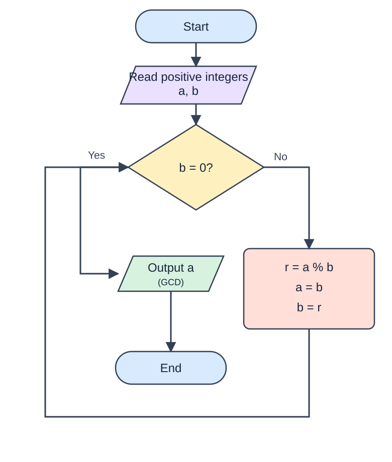

<section id="quiz-intro">
  
<strong>13 questions · 22 points · 45 minutes</strong>

<strong>PRACTICE TEST – NOT GRADED</strong>
This is a practice version of Midterm Quiz 01. Results are for self-assessment only and <strong>will not count toward your semester grade</strong>. The official quiz carries 10% of the semester grade.

  
<strong>Practice assessment rules</strong>
Work individually. Do not use AI assistants, external websites, search engines, notes, or another person's solutions. You may use the tools and sample solutions provided on this test page; viewing a solution is recorded.

Keep this browser tab active. The first detected tab/window switch triggers a warning; the second ends the attempt. Refreshing does not reset the timer. This is practice. Only Evaluate my work submits to Azure; unfinished answers are saved locally in this browser. Closing the page may lose your work.

<strong>Private pilot:</strong> Submissions are saved to Azure and theory answers are scored. Python scoring is pending. AI feedback requires Azure OpenAI configuration. Do not publish for students.

  
<label>Neptun code <input id="quiz-neptun" maxlength="6" placeholder="ABC123" autocomplete="off"></label>

  
<label><input type="checkbox" id="quiz-agree"> I have read and accept the test rules.</label>

  <button id="quiz-start">Start practice test</button>

<strong>Unfinished attempt detected.</strong> Your timer continues while the page is closed.
<button type="button" id="quiz-resume">Continue existing attempt</button>

</section>
<section id="quiz-work" hidden>
  
<strong>Neptun:</strong>  · <strong>Time remaining:</strong> 45:00 · 

  
<button type="button" id="quiz-new-attempt-top">Start new practice attempt (45 minutes)</button><button type="button" id="quiz-exit">Exit practice test</button>

  
Warning: leaving this test again will end the current attempt.

  <h2>Theory questions (10 points)</h2>
  <section class="question"><h3>Question 1 <small>(1 point)</small></h3>
Data that has been organized and has meaning is referred to as ...
<label class="choice"><input type="radio" name="q1" value="a"> Wisdom</label><label class="choice"><input type="radio" name="q1" value="b"> Knowledge</label><label class="choice"><input type="radio" name="q1" value="c"> Information</label><label class="choice"><input type="radio" name="q1" value="d"> Raw data</label></section>
<section class="question"><h3>Question 2 <small>(1 point)</small></h3>
Which historical machine was designed to calculate polynomials but was not built in the inventor’s lifetime?
<label class="choice"><input type="radio" name="q2" value="a"> ENIAC</label><label class="choice"><input type="radio" name="q2" value="b"> Abacus</label><label class="choice"><input type="radio" name="q2" value="c"> Vannevar Bush’s Differential Analyzer</label><label class="choice"><input type="radio" name="q2" value="d"> Charles Babbage’s Difference Engine</label></section>
<section class="question"><h3>Question 3 <small>(1 point)</small></h3>
Which of the following is an advantage of using pseudocode as an algorithmic description tool?
<label class="choice"><input type="radio" name="q3" value="a"> It is easy to understand and language-independent.</label><label class="choice"><input type="radio" name="q3" value="b"> It provides detailed information about all algorithm steps.</label><label class="choice"><input type="radio" name="q3" value="c"> It promotes language-specific syntax.</label><label class="choice"><input type="radio" name="q3" value="d"> It is executable on any machine.</label></section>
<section class="question"><h3>Question 4 <small>(1 point)</small></h3>
What is a common disadvantage of using flowcharts as a tool for describing algorithms?
<label class="choice"><input type="radio" name="q4" value="a"> They are difficult to understand</label><label class="choice"><input type="radio" name="q4" value="b"> They may be time-consuming to create for complex algorithms.</label><label class="choice"><input type="radio" name="q4" value="c"> They are language-specific</label><label class="choice"><input type="radio" name="q4" value="d"> They are not visual representations</label></section>
<section class="question"><h3>Question 5 <small>(1 point)</small></h3>
Which of the following is NOT a property of data types, according to the lecture?
<label class="choice"><input type="radio" name="q5" value="a"> Complexity</label><label class="choice"><input type="radio" name="q5" value="b"> Right to Access</label><label class="choice"><input type="radio" name="q5" value="c"> Identifier</label><label class="choice"><input type="radio" name="q5" value="d"> Scope</label></section>
<section class="question"><h3>Question 6 <small>(1 point)</small></h3>
What does the range() function in Python return when used in a for loop?
<label class="choice"><input type="radio" name="q6" value="a"> A random number</label><label class="choice"><input type="radio" name="q6" value="b"> A string value</label><label class="choice"><input type="radio" name="q6" value="c"> A single number</label><label class="choice"><input type="radio" name="q6" value="d"> A sequence of numbers within a given range</label></section>
<section class="question"><h3>Question 7 <small>(1 point)</small></h3>
Which statement is used to exit a loop immediately in Python, regardless of the loop condition?
<label class="choice"><input type="radio" name="q7" value="a"> continue</label><label class="choice"><input type="radio" name="q7" value="b"> break</label><label class="choice"><input type="radio" name="q7" value="c"> return</label><label class="choice"><input type="radio" name="q7" value="d"> pass</label></section>
<section class="question"><h3>Question 8 <small>(1 point)</small></h3>
What is the role of the logical and operator in Python?
<label class="choice"><input type="radio" name="q8" value="a"> It returns False only if both operands are False.</label><label class="choice"><input type="radio" name="q8" value="b"> It returns True if at least one operand is True.</label><label class="choice"><input type="radio" name="q8" value="c"> It returns True if both operands are True.</label><label class="choice"><input type="radio" name="q8" value="d"> It returns False if both operands are True</label></section>
<section class="question"><h3>Question 9 <small>(1 point)</small></h3>
Which of the following operators is used for floor division in Python?
<label class="choice"><input type="radio" name="q9" value="a"> //</label><label class="choice"><input type="radio" name="q9" value="b"> %</label><label class="choice"><input type="radio" name="q9" value="c"> /</label><label class="choice"><input type="radio" name="q9" value="d"> **</label></section>
<section class="question"><h3>Question 10 <small>(1 point)</small></h3>
What type of programming language is Python?
<label class="choice"><input type="radio" name="q10" value="a"> Low-level programming language</label><label class="choice"><input type="radio" name="q10" value="b"> General-purpose, high-level programming language</label><label class="choice"><input type="radio" name="q10" value="c"> Scripting language only</label><label class="choice"><input type="radio" name="q10" value="d"> Assembly language</label></section>
  <h2>Python exercises (12 points)</h2>
  <section class="question"><h3>Question 11 – Translate the algorithm into Python (4 points)</h3>
Translate the Euclidean algorithm shown in the flowchart into Python code. Read two positive integers and print their greatest common divisor. Your program must follow the remainder-based algorithm (<code>%</code>), rather than calling a built-in GCD function.

Follow the flowchart steps. A correct result obtained with a different algorithm does not receive full marks.

</section>
  <section class="question"><h3>Question 12 – BMI calculator (4 points)</h3>
Write a program that calculates a person's Body Mass Index (BMI) and determines their health status:

If BMI is less than 18.5, print "Underweight". If BMI is between 18.5 and 24.9, print "Normal weight". If BMI is between 25 and 29.9, print "Overweight". If BMI is 30 or greater, print "Obesity".

BMI = weight / height ** 2 (weight in kilograms, height in meters).

</section>
  <section class="question"><h3>Question 13 – Login attempts (4 points)</h3>
Write a Python program that checks whether a user enters the correct username and password. Allow up to 3 attempts. After 3 incorrect attempts, display a message indicating that no attempts remain.

For this practice exercise, the valid username is <code>student</code> and the password is <code>python123</code>. Read the username and password on each attempt. Print <code>Login successful</code> for a valid login, or <code>No more attempts left</code> after three unsuccessful attempts.

</section>
  <section class="question"><h2>Evaluate my work</h2>
<strong>Practice only — not graded.</strong> Only Evaluate my work sends your answers to Azure. Unfinished attempts are stored locally in this browser. Theory questions are scored on the server; Python scoring is pending. AI feedback includes approximate Python scores (not an official grade) when configured on the server.
<button id="quiz-evaluate">Evaluate my work</button>

<button type="button" id="quiz-new-attempt">Start new practice attempt (45 minutes)</button>
Submitted results remain saved in Azure. Unsubmitted attempts are discarded. Starting again creates a separate attempt.

</section>
</section>

